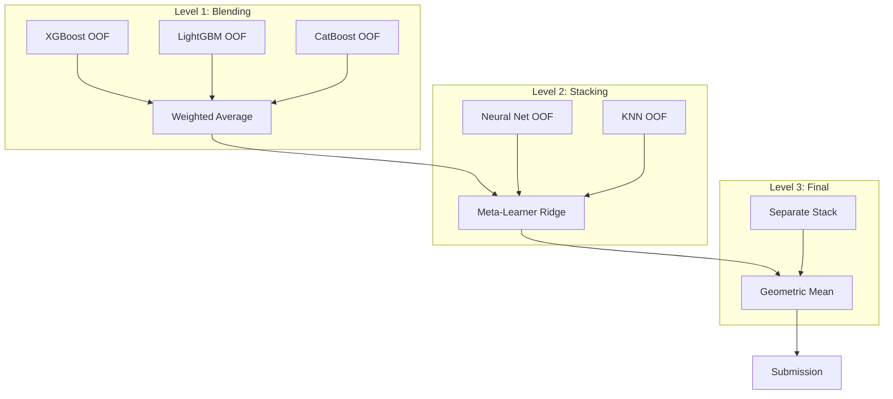

<details><summary>Sources</summary>

- [[../../raw/kaggle/kaggle-competition-playbook.md]] — ensembling section
- [[../../raw/kaggle/solutions/srk-batch-1.md]] through srk-batch-14.md — ensemble patterns from 226 winning solutions
- [[../../raw/kaggle/grandmaster-meta-strategies.md]] — KazAnova stacking principles

</details>

## What It Is
Ensembling combines predictions from multiple models to reduce variance and improve generalization. On Kaggle, ensembles consistently outperform single models, often by a meaningful margin (0.001–0.01 depending on metric scale). The key insight: **models that make different errors are more valuable than models that are individually better**.



## Level 1: Weighted Average Blending

The simplest ensemble: weighted mean of predictions from N models.

### Naive Weighted Average
```python
ensemble = 0.4 * preds_lgb + 0.4 * preds_xgb + 0.2 * preds_catboost
```
Weights chosen by CV score or tuned via hill-climbing on OOF predictions.

### Fourth-Root Blend (Recommended)
Rather than weighting linearly by score improvement over baseline, use fourth-root weighting. This compresses differences — a model 2× better than another gets ~1.19× the weight, not 2×. Prevents dominant models from crowding out diverse ones.

```python
import numpy as np
from scipy.stats import rankdata

# 1. Rank-normalize predictions (removes scale differences between models)
rank_preds = [rankdata(p) / len(p) for p in model_preds_list]

# 2. Compute CV improvement over baseline for each model
baseline_cv = 0.80
cv_scores = [0.842, 0.851, 0.838]  # per model

# 3. Fourth-root weights
raw_weights = [(cv - baseline_cv) ** 0.25 for cv in cv_scores]
weights = np.array(raw_weights) / sum(raw_weights)

# 4. Weighted blend of rank-normalized predictions
ensemble = sum(w * p for w, p in zip(weights, rank_preds))
```

**When rank-normalization matters**: When models output predictions on different scales (e.g., one outputs raw logits, another outputs calibrated probabilities). Rank-normalization puts all models on a common [0,1] scale.

### Hill-Climbing Blend (with `hillclimbers` library)
Greedy search for optimal weights on OOF predictions. More robust than weight optimization because it implicitly regularizes ensemble composition.

```python
# pip install hillclimbers
from hillclimbers import climb

best_weights = climb(
    predictions_list,    # list of OOF pred arrays
    y_true,
    metric="roc_auc",    # or "rmse", "logloss"
    maximize=True,
    n_iterations=1000
)
```

Custom implementation:
```python
# Start with best single model; greedily add other models
ensemble = best_model_preds.copy()
for iteration in range(max_iter):
    for candidate in all_model_preds:
        trial = (ensemble + candidate) / 2
        if score(trial, y_val) > score(ensemble, y_val):
            ensemble = trial
```

**S5E12 1st place:** Used Hill Climbing to find diverse subset, then switched to Ridge when HC plateaued — a two-stage approach that broke through a score ceiling.

**Library:** https://github.com/Matt-OP/hillclimbers (built by a Kaggler specifically for OOF-based weight optimization)

### Ridge with Negative Weights Allowed
For ensemble weight optimization, `positive=False, fit_intercept=False` allows negative weights. Better than constrained positive regression when some models genuinely hurt the ensemble.
```python
from sklearn.linear_model import Ridge
meta = Ridge(alpha=10.0, fit_intercept=False, positive=False)
meta.fit(oof_matrix, y_train)
```

## Level 2: Stacking

Train a meta-learner on out-of-fold level-1 predictions. The meta-learner learns which models to trust for which inputs.

### Full Implementation
```python
from sklearn.model_selection import KFold
from sklearn.linear_model import Ridge, LogisticRegression
import numpy as np

kf = KFold(n_splits=5, shuffle=True, random_state=42)

# Generate OOF predictions from each level-1 model
oof_matrix = np.zeros((len(X_train), len(level1_models)))
test_matrix = np.zeros((len(X_test), len(level1_models)))

for i, model in enumerate(level1_models):
    oof_preds = np.zeros(len(X_train))
    test_fold_preds = []
    for tr_idx, val_idx in kf.split(X_train):
        model.fit(X_train[tr_idx], y_train[tr_idx])
        oof_preds[val_idx] = model.predict_proba(X_train[val_idx])[:, 1]
        test_fold_preds.append(model.predict_proba(X_test)[:, 1])
    oof_matrix[:, i] = oof_preds
    test_matrix[:, i] = np.mean(test_fold_preds, axis=0)

# Level 2: Ridge (regression) or LogisticRegression (classification)
meta = Ridge(alpha=1.0)          # use LogisticRegression for binary classification
meta.fit(oof_matrix, y_train)
final_preds = meta.predict(test_matrix)
```

### Why Ridge at Level 2?
- Simple, fast, doesn't overfit on small input (N_models columns)
- Coefficients are interpretable — they're the model weights (negative = that model hurts)
- Adding raw features to level-2 input sometimes helps if stacking CV plateaus

### Stacking Tips
- Always use OOF for level-2 training — no exceptions
- Don't add too many level-1 models without diversity (correlated models add noise)
- Check meta-learner coefficients: if a model gets negative weight, drop it
- Optionally: add original features to level-2 input (blending stacking with direct features)
- **n_estimators when retraining on full data:** `n_estimators = 1.25 × average best CV iteration` (from S6E2 1st place; accounts for more data in full training)
- **20 random seeds averaged** on full-data retraining — variance reduction; cheaper than more folds

### Optuna Subset Selection (150 OOF files → 15 useful)

Don't average everything. Use Optuna to select the complementary subset:

```python
import optuna
import numpy as np
from sklearn.metrics import roc_auc_score

oof_files = [...]  # list of 150+ OOF prediction arrays
y_true = ...

def objective(trial):
    selected = [
        oof_files[i] for i in range(len(oof_files))
        if trial.suggest_categorical(f"use_{i}", [True, False])
    ]
    if not selected:
        return 0
    ensemble = np.mean(selected, axis=0)
    return roc_auc_score(y_true, ensemble)

study = optuna.create_study(direction="maximize")
study.optimize(objective, n_trials=2500)
```

**S6E2 pattern:** 150 OOF files, 2500 Optuna trials, ~15 consistently selected. Nonlinear stacking overfitted; Ridge was more reliable than Optuna for the final weighting.

### CatBoost as Meta-Learner (via `baseline` parameter)

A powerful and underused trick: pass any model's predictions as `baseline=` to CatBoost, which then learns to IMPROVE upon them.

```python
# Hardy Xu 1st place technique (S4E10):
# 1. Train base model (e.g., LightGBM) on full data, get predictions
# 2. Pass as baseline to CatBoost
base_preds = lgbm_model.predict(X_train)  # or predict_proba

cat_model = CatBoostClassifier(
    n_estimators=1000,
    learning_rate=0.05,
    ...
)
# CatBoost will learn residuals on top of base_preds
pool = Pool(X_train, y_train, baseline=base_preds)
cat_model.fit(pool)
```

**Measured improvements** (S4E10):
| Base Model | Without CatBoost refinement | With CatBoost refinement | Delta |
|---|---|---|---|
| LightGBM | 0.96811 | 0.96856 | +0.00045 |
| XGBoost | 0.96767 | 0.96815 | +0.00048 |
| CatBoost (self) | 0.96972 | 0.96997 | +0.00025 |
| NN | 0.96678 | 0.96732 | +0.00054 |

Works for CatBoost refining its OWN predictions too.

### AutoGluon as a Free Ensemble Member

In 2024, AutoGluon won 7 gold medals and 15 top-3 finishes in 18 tabular Kaggle competitions. It's the most powerful "free" ensemble member to add.

```python
from autogluon.tabular import TabularPredictor

# Train AutoGluon on your folds
predictor = TabularPredictor(label="target").fit(
    train_data, presets="best_quality", time_limit=3600
)

# Get OOF predictions and include in your stack
# AutoGluon handles its own internal stacking + fold logic
```

**S4E11 1st place:** AutoGluon for OOF ensembling outperformed hill climbing, Ridge, and logistic regression for that specific task. Sometimes AutoGluon as the final meta-learner beats hand-rolled approaches.

**Key:** AutoGluon's OOF predictions add genuine diversity — it trains 10+ model families with different hyperparameters internally.

## Diversity — The Core Principle

**Ensemble value comes from diversity, not raw performance.**

Two models with CV=0.85 that correlate at 0.99 are worth less than one model at 0.85 + one at 0.83 that correlates at 0.80.

### Measuring Diversity
```python
import pandas as pd
oof_df = pd.DataFrame({'lgb': lgb_oof, 'xgb': xgb_oof, 'catboost': cat_oof})
print(oof_df.corr())  # want off-diagonal < 0.95
```

### Sources of Diversity
| Source | How |
|--------|-----|
| Algorithm | LGB vs XGB vs CatBoost vs LogReg |
| Model family | Tree vs. GRU vs. Transformer vs. CNN |
| Depth | `max_depth` 5 vs 7 vs 9 |
| Feature sets | With/without text features, different encodings |
| Seeds | Different random seeds (small but real) |
| Target transforms | Log-transformed vs raw target |
| Folds | Different CV splits |
| Data modality | Raw tabular vs. tabular-to-image (DeepInsight) |

### Selection Heuristic
Pick 2 final submissions:
1. **Best CV score** — safe choice
2. **Highest-CV among models with low correlation to #1** — adds insurance

## Tree + Sequence Model Blends

When a competition has temporal or sequential structure, blending trees with GRU/Transformer provides strong complementary diversity. From Optiver Trading at the Close (1st place):

```python
# Weights chosen by OOF score
catboost_weight = 0.50   # tree model: stable, handles tabular features well
gru_weight      = 0.30   # GRU: captures temporal sequence patterns
transformer_weight = 0.20  # Transformer: attention over time steps

ensemble = (
    catboost_weight      * catboost_preds +
    gru_weight           * gru_preds +
    transformer_weight   * transformer_preds
)
```

**Why CatBoost dominates at 50%**: Most stable on tabular features; GRU and Transformer are noisier but add sequential signal that CatBoost misses entirely.

## Post-Processing: Weighted Mean Subtraction

For competitions where predictions should be zero-centered within groups (e.g., closing auction relative price movements), apply weighted mean subtraction:

```python
# Standard (simple mean): subtract unweighted mean per group
simple_mean = preds.groupby('time_id').transform('mean')
preds_adjusted = preds - simple_mean

# Better (weighted mean): weight by stock liquidity/market cap
def weighted_mean_adjust(preds_df, weight_col='stock_weight', bucket_col='time_id'):
    def wmean(g):
        return np.average(g['pred'], weights=g[weight_col])
    bucket_wmeans = preds_df.groupby(bucket_col).apply(wmean)
    return preds_df['pred'] - preds_df[bucket_col].map(bucket_wmeans)
```

This is distinct from model-level post-processing (calibration) — it adjusts the geometric structure of predictions within groups to match economic reality (large-cap stocks have more influence on index price).

## In Jason's Work

### March Mania v6 Ensemble
Fixed 35/35/30 weighted blend. The v5 hybrid component provides explicit diversity (includes LogReg + Elo baseline alongside XGBoost). This is a manually-tuned weighted average, not stacking — no meta-learner was trained.

### Mega Ensemble (`mega_ensemble.py`)
Much broader: LR, Ridge, RF, ExtraTrees, KNN, SVM, MLP, GaussianProcess, XGBoost, LightGBM, CatBoost. Feature preprocessing and RFE selection. A proper level-1 ensemble base for stacking experiments.

## Sources
- [[../../raw/kaggle/kaggle-competition-playbook.md]] — §8 ensembling: fourth-root blend and stacking
- [[../../raw/kaggle/v6-ensemble-documentation.md]] — weighted average in practice (March Mania v6)
- [[../../raw/kaggle/solutions/optiver-close-1st-hyd.md]] — CatBoost+GRU+Transformer blend, weighted-mean post-processing
- [[../../raw/kaggle/solutions/moa-1st-mark-peng.md]] — 7-model weighted blend with DeepInsight + TabNet
- [[../../raw/kaggle/2024-2025-winning-solutions-tabular.md]] — CatBoost baseline trick, hill climbing, AutoGluon, Optuna subset selection
- [[../../raw/kaggle/modern-tabular-dl-techniques.md]] — hillclimbers library, AutoGluon benchmarks
- [[../../raw/kaggle/grandmaster-meta-strategies.md]] — ensemble selection principles
- [[../../raw/kaggle/solutions/missing-batch-finance-tabular.md]] — Otto Group (501 votes, canonical 33-model ensemble), Allstate (482 votes, deep GBDT blending), Prudential (189 votes, XGBoost+NN blend)

## Related
- [[../strategies/march-mania-v6-ensemble]] — weighted average applied to March Mania
- [[../strategies/kaggle-meta-strategy]] — ensemble selection as part of overall strategy
- [[../concepts/validation-strategy]] — OOF is required for correct stacking
- [[../concepts/xgboost-ensembles]] — XGBoost-specific ensemble patterns
- [[../concepts/calibration]] — calibrate before ensembling for cleaner blending
- [[../concepts/online-learning]] — retraining individual ensemble members during test phase
- [[../concepts/deep-learning-tabular]] — GRU/Transformer/DeepInsight as ensemble components
- [[../concepts/stacking-deep]] — full 3-level stacking with 90+ models
- [[../concepts/tabpfn-tabm]] — TabPFN and TabM as diverse ensemble members
- [[../concepts/post-processing]] — post-process after ensembling

<!-- kg:begin -->
<!-- This block is auto-generated by tools/inject_kg_blocks.py — do not hand-edit -->
## Knowledge Graph

**Outgoing:**
- _applied_in_ → [[competitions/horse-health-prediction|Horse Health Prediction (Kaggle Playground)]]
- _applied_in_ → [[competitions/playground-s5-s6|Kaggle Playground Series S5 & S6 Winning Patterns (2025-2026)]]
- _cites_ → `source:2024-2025-winning-solutions-tabular` (2024–2025 Winning Solutions: Tabular/Financial/Insurance Competitions)
- _cites_ → `source:grandmaster-meta-strategies` (Kaggle Grandmaster Meta-Strategies)
- _cites_ → `source:kaggle-competition-playbook` (Kaggle Competition Playbook)
- _cites_ → `source:missing-batch-finance-tabular` (Kaggle Solutions — Missing Batch — Finance & Tabular Classics)
- _cites_ → `source:moa-1st-mark-peng` (Mechanisms of Action (MoA) Prediction — 1st Place Solution)
- _cites_ → `source:modern-tabular-dl-techniques` (Modern Deep Learning & Advanced Techniques for Tabular Kaggle (2023–2025))
- _cites_ → `source:optiver-close-1st-hyd` (Optiver Trading at the Close — 1st Place Solution)
- _cites_ → `source:v6-ensemble-documentation` (March Mania 2026: v6 Ensemble Model (0.02210 LB))
- _works_with_ → [[concepts/calibration|Probability Calibration — Platt Scaling and Isotonic Regression]]
- _works_with_ → [[concepts/deep-learning-tabular|Deep Learning on Tabular Data — When DNNs Beat GBMs]]
- _works_with_ → [[concepts/online-learning|Online Learning — Retraining During Test, Memory Management, Incremental Adaptation]]
- _works_with_ → [[concepts/post-processing|Post-Processing — RankGauss, Calibration, Clipping, Rank Blending]]
- _works_with_ → [[concepts/stacking-deep|Deep Stacking — Multi-Level Stacking Architectures]]
- _works_with_ → [[concepts/tabpfn-tabm|TabPFN & TabM — New SOTA Tabular Foundation Models]]
- _works_with_ → [[concepts/validation-strategy|Validation Strategy — CV Design, Gap Tracking, Anti-Patterns]]
- _works_with_ → [[concepts/xgboost-ensembles|XGBoost Ensembles — Weighted Averaging of Gradient Boosted Trees]]

**Incoming:**
- [[strategies/kaggle-competition-playbook|Kaggle Competition Playbook — End-to-End Workflow]] _requires_ → here
- [[strategies/kaggle-meta-strategy|Kaggle Meta-Strategy — Grandmaster Principles for Any Competition]] _requires_ → here
- [[strategies/march-mania-v6-ensemble|March Mania v6 Ensemble — Weighted 3-Pipeline Architecture]] _requires_ → here
- [[tools/autoresearch|AutoResearch — Autonomous Agent Experimentation for ML Contests]] _requires_ → here
- [[entities/machine-learning-advisor|MachineLearningAdvisor]] _requires_ → here
- [[concepts/deep-learning-tabular|Deep Learning on Tabular Data — When DNNs Beat GBMs]] _works_with_ → here
- [[concepts/denoising-autoencoders|Denoising Autoencoders — Tabular Representation Learning]] _works_with_ → here
- [[concepts/gradient-boosting-advanced|Gradient Boosting — Advanced Configuration Tricks]] _works_with_ → here
- [[concepts/imbalanced-data|Imbalanced Data Techniques for Kaggle]] _works_with_ → here
- [[concepts/kaggle-landscape-2024-2026|Kaggle Competitive Landscape 2024-2026]] _works_with_ → here
- [[concepts/knowledge-distillation|Knowledge Distillation — LGBM→NN Soft Labels, Cosine Schedules, Cross-Model Transfer]] _works_with_ → here
- [[concepts/llm-fine-tuning-kaggle|LLM & Transformer Fine-Tuning for Kaggle NLP]] _works_with_ → here
- [[concepts/online-learning|Online Learning — Retraining During Test, Memory Management, Incremental Adaptation]] _works_with_ → here
- [[concepts/post-processing|Post-Processing — RankGauss, Calibration, Clipping, Rank Blending]] _works_with_ → here
- [[concepts/pseudo-labeling|Pseudo-Labeling — Semi-Supervised Learning with High-Confidence Test Predictions]] _works_with_ → here
- [[concepts/stacking-deep|Deep Stacking — Multi-Level Stacking Architectures]] _works_with_ → here
- [[concepts/tabpfn-tabm|TabPFN & TabM — New SOTA Tabular Foundation Models]] _works_with_ → here
- [[concepts/text-feature-engineering|Text Feature Engineering — Embeddings vs TF-IDF vs Regex Extraction]] _works_with_ → here
- [[concepts/universal-kaggle-tricks|Universal Kaggle Tricks — Cross-Competition Validated Techniques]] _works_with_ → here
- [[concepts/validation-strategy|Validation Strategy — CV Design, Gap Tracking, Anti-Patterns]] _works_with_ → here
- [[index|Wiki Index]] _related_to_ → here

<!-- kg:end -->
