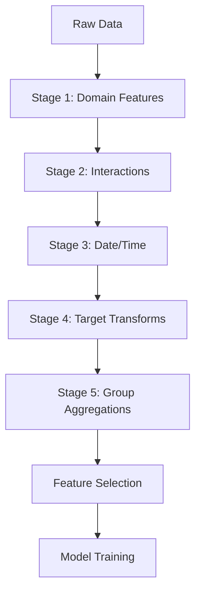

<details><summary>Sources</summary>

- [[../../raw/kaggle/kaggle-competition-playbook.md]] — 5-stage FE process
- [[../../raw/kaggle/2024-2025-winning-solutions-tabular.md]] — recent winning FE patterns
- [[../../raw/kaggle/march-mania-v6-ensemble-doc.md]] — basketball-specific features

</details>

## What It Is
Feature engineering for tabular data transforms raw records into signals that ML models can leverage. For gradient boosting (XGBoost, LightGBM, CatBoost), good features often matter more than model choice.



## Key Feature Categories

### Efficiency / Rating Metrics
**Four Factors** (basketball-specific, widely used in March Mania):
| Factor | Formula | What It Captures |
|--------|---------|-----------------|
| eFG% | (FG + 0.5×3P) / FGA | Shooting efficiency |
| TOV% | TOV / (FGA + 0.44×FTA + TOV) | Turnover rate |
| ORB% | ORB / (ORB + Opp DRB) | Offensive rebounding |
| FT rate | FTA / FGA | Free throw generation |

Both offensive and defensive versions needed (6 features total per team).

### Rating Systems
- **Elo Rating**: Iteratively updated from game outcomes. Simple, powerful, naturally calibrated as a probability signal. Strongest single predictor for tournament matchups.
- **Pythagorean Win %**: `points_for² / (points_for² + points_against²)` — better than raw W/L for true strength.
- **Massey Ordinals**: Consensus ranking from 50+ computer rating systems. Used in March Mania selection process.

### Schedule/Context
- **Strength of Schedule (SOS)**: Average Elo or efficiency of opponents played
- **Tournament Experience**: Count of prior tournament appearances (teams with more experience perform better under pressure)
- **Conference Strength**: Average of conference members' ratings

### Temporal Features
- **Momentum (30-day)**: Performance trend over last month of regular season
- **Recency weighting**: Lesson from v12 — weighting recent games heavily HURT March Mania performance; tournament success correlates with full-season consistency

### Pace/Style
- **Pace**: Possessions per 40 minutes — normalizes all counting stats
- **Style matchup**: Fast vs. slow team interactions

## Preprocessing Patterns

### Normalization
- Tree models (XGBoost, LightGBM) don't need feature scaling
- Linear models (LogReg, SVM) require StandardScaler or MinMaxScaler
- Apply separately to train/val to avoid leakage

### Encoding Categoricals
- XGBoost: can handle label-encoded categoricals; CatBoost handles them natively
- LightGBM: use `categorical_feature` parameter
- LogReg: one-hot encode

### Handling Missing Values
- XGBoost: native NaN handling (learns optimal split direction)
- LightGBM: similar native handling
- Other models: impute with median/mean or flag with indicator column

## The 5-Stage Feature Engineering Process

From the Kaggle Competition Playbook — apply stages in order:

### Stage 1: Hand-Crafted Domain Features
Subject-matter knowledge features. In basketball: Elo, Four Factors, SOS. In finance: ratios, returns. **These are always the highest-leverage features** — invest here first before automated methods.

### Stage 2: Stepwise Interaction Search
Don't exhaustively generate all pairwise interactions. Instead:
1. Train baseline model, get feature importances.
2. Take top-N features (e.g., top 10).
3. Generate pairwise products and ratios for just those top-N.
4. Add each interaction one at a time, keeping only those that improve CV.

**Anti-pattern**: Picking interactions by correlation to target — biased toward spurious/leaky features.

### Stage 3: Date/Time Components
From any datetime column: year, month, day-of-week, day-of-year, week-of-year, is_weekend, is_holiday, days since epoch, time since last event.

### Stage 4: Target Transforms
- **Regression**: `log1p(target)` for right-skewed targets (remember `expm1` at inference). Box-Cox/Yeo-Johnson for general normalization.
- **Imbalanced classification**: Class weights first (`scale_pos_weight` in XGBoost, `is_unbalance` in LightGBM). Oversampling as last resort.

### Stage 5: Group Aggregations
For each categorical group variable, compute aggregations of numeric features:
```python
agg = df.groupby(group_col)[num_col].agg(['mean', 'std', 'min', 'max', 'median', 'count'])
agg.columns = [f'{num_col}_{group_col}_{s}' for s in ['mean','std','min','max','median','count']]
df = df.merge(agg, on=group_col, how='left')
```
The `std` and skew within a group often capture heterogeneity that mean alone misses.

---

## Leakage Risks
- **Game-day features**: anything derived from the actual game outcome leaks
- **Tournament-seed features**: seeds are announced Selection Sunday; can't use for prediction if testing earlier in pipeline
- **Opponent stats computed on same dataset**: compute opponent features on training set, not test set opponents

## In Jason's Work

### March Mania v6
Primary features: Four Factors (off + def = 8 features), Elo Rating, Pythagorean Win %, Massey Ordinals, Momentum (30-day), SOS, Tournament Experience, Pace.

**v11 Lesson**: Adjusted efficiency (accounting for opponent quality) didn't improve on raw Four Factors + Elo. The base features may implicitly capture this already.

**v12 Lesson**: Recency weighting (prioritizing last 30 days) hurt. Tournament prediction benefits from full-season consistency signals.

## Sources
- [[../../raw/kaggle/v6-ensemble-documentation.md]] — feature list for March Mania v6
- [[../../raw/kaggle/memory-2026-02-22.md]] — v11/v12 feature experiment notes
- [[../../raw/kaggle/kaggle-competition-playbook.md]] — §5 five-stage process, §4 missing values, §3 variable typing

## Related
- [[../strategies/march-mania-v6-ensemble]] — how these features are used in the ensemble
- [[../strategies/kaggle-competition-playbook]] — full playbook with this as Phase 5
- [[../concepts/target-encoding]] — Stage 1/2 for high-cardinality categoricals
- [[../concepts/text-feature-engineering]] — text columns alongside tabular
- [[../concepts/xgboost-ensembles]] — models that consume these features
- [[../concepts/calibration]] — post-feature-engineering probability adjustment
