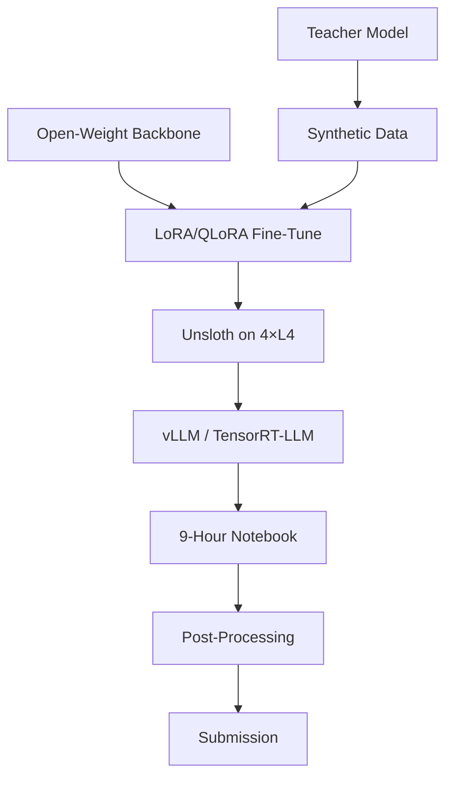

Sources

- [[../../raw/kaggle/kaggle-meta-2024-2026.md]] — comprehensive meta-analysis of winning patterns mid-2024 through April 2026
- [[../../raw/kaggle/kaggle-meta-2024-2026-links.md]] — curated reference links: arXiv papers, model cards, GitHub repos, blog posts

## Summary

Ensembled fine-tuned open-source foundation models — not bespoke architectures — now dominate nearly every Kaggle leaderboard. The differentiator is no longer "which model" but whose synthetic data, whose test-time tricks, and whose cross-validation discipline. Three patterns are unusually load-bearing: (1) teacher→student distillation, (2) post-processing worth 0.01-0.03 LB, and (3) farid.one/kaggle-solutions as the single highest-ROI research resource.

## The Canonical Stack (2025-2026)

**Start from a strong open-weight backbone, fine-tune with LoRA/QLoRA via Unsloth on Kaggle's free 4×L4 or 2×T4 instances, and serve inference through vLLM or TensorRT-LLM inside the 9-hour notebook limit.**

| Domain | Default Backbone | Fine-Tune Method |
|--------|-----------------|-----------------|
| Tabular | XGBoost/LightGBM/CatBoost | cuML 3-level stacks via RAPIDS |
| Text/Multimodal | Gemma2-9B or Qwen2.5-14B/32B | QLoRA on synthetic teacher labels |
| Images | EVA-02-Large, ConvNeXt-V2, DINOv3 | Standard fine-tuning + TTA |
| Math/Reasoning | Qwen2.5-14B fine-tuned | SFT on distilled CoT + TIR inference |

### Kaggle Hardware Constraints

- **9-hour runtime** with 20-minute idle timeout per notebook session
- **30 GPU-hours/week** per user; internet-off for code competitions
- **4×L4 GPUs** replaced P100/T4s for selected competitions (2025)
- **Kaggle Packages** submission format: `Model` class with `predict()` method (since "Drawing with LLMs")
- AIMO-2/3 selected teams got up to **128 H100s** via Fields Model Initiative

## Three Load-Bearing Patterns

### 1. Synthetic Data Distillation (80% of gold medals)

Teacher model (DeepSeek-R1, QwQ-32B, Gemini, GPT-4o) generates synthetic training data → distill into a smaller student that fits in Kaggle's runtime. See [[synthetic-data-distillation]] for the full pattern.

**AIMO-2 case study:** NVIDIA's NemoSkills team won 34/50 with OpenMath-Nemotron-14B-Kaggle — a Qwen2.5-14B-Base fine-tuned on 306K problems with 2.2M CoT + 15K TIR solutions distilled from DeepSeek-R1 and QwQ-32B. Self-consistency voting + heuristic early stopping at inference.

### 2. Post-Processing as Gold-vs-Silver Differentiator

Post-processing worth **+0.01 to +0.03 private-LB** almost always exists. Hunting for leaks, label-distribution mismatches, and subject-level invariants is now a primary skill. See [[post-processing]] for techniques.

**Key examples:**
- **CMI Detect Behavior**: Two subjects wore device rotated 180° around Z-axis — detecting and correcting this gained meaningful private-LB points
- **Open Polymer 2025**: Tg unit (°C vs K) distribution shift detected via ±0.1σ probing — empirical correction worth significant gain
- **Home Credit 2024**: Time-conditional score adjustment (~0.0X) dwarfed pure ML differences (~0.00X)

### 3. farid.one as the Definitive Research Resource

[farid.one/kaggle-solutions](https://farid.one/kaggle-solutions) (updated April 17, 2026) indexes **695 competitions** — the single highest-ROI resource for pattern-matching winning approaches to a new competition. Mirror at [kaggle.farid.one](https://kaggle.farid.one).

## Test-Time Training (TTT) and Refinement Loops

Test-time training and iterative refinement have displaced pure pretraining + zero-shot inference as the competitive default for reasoning tasks.

**ARC Prize progression:**
- **2024**: ARChitects won at 53.5% with NeMo-Minitron-8B + augmentation + stability selection
- **2025**: NVARC won at 24.03% (harder ARC-AGI-2) using TTT + heavy synthetic data; Tiny Recursive Model (~7M params) achieved ~45% on AGI-1 via architectural recursion alone

## Competition-Specific Highlights

### LLM Competitions
- **AIMO-2** (April 2025): NemoSkills 34/50; teacher distillation + code-execution at inference beats raw scaling
- **Konwinski Prize** ($1M SWE-bench variant): No grand prize; Genxxsky 1st with retrieval-heavy agent pipeline
- **WSDM Cup 2025**: Gemma2-9B QLoRA classifier + prompt/response length features
- **LLM 20 Questions**: Binary-search-over-vocabulary protocol design beat model scale

### Science/Biology
- **Stanford RNA 3D Folding**: TBM approach → integrated into NVIDIA's RNAPro
- **Open Polymer 2025**: GATv2Conv + Morgan fingerprints; **Tg unit bug was the key insight**
- **CSIRO Image2Biomass**: DINOv3 emerging as default image backbone
- **Ariel 2025**: Bayesian inference beat black-box ML — rare but instructive

### Medical/Sensor
- **RSNA 2024 Lumbar Spine**: 1,874 teams; multi-stage detection + severity classification
- **ISIC 2024**: GBDTs on metadata + small CNN beat pure image models (15mm crops left little pixel signal)
- **CMI Detect Behavior**: 1D CNN-RNN with modality branches + Hungarian-matching post-processing
- **PhysioNet ECG**: Top-27 all published — preprocessing was the primary differentiator

### Trading/Tabular
- **MITSUI Commodity** ($100K): Directional-trend modeling over volatility prediction; transformer sequences
- **Playground S5-S6**: 3-level cuML stacks with 100+ OOF predictions; Chris Deotte's NVIDIA playbook
- **Santa 2025**: Sparrow algorithm + simulated annealing — classic OR methods, not ML

### Novel 2026 Formats
- **Deep Past Challenge** ($50K): Akkadian cuneiform → English on ByT5; data curation > model size
- **Vesuvius Surface Detection** ($200K): nnU-Net + median-filter post-processing
- **MedGemma Impact** ($100K): Hosted-package deployment, not pure prediction
- **Google Tunix Hack**: First JAX-native LLM post-training competition
- **AIMO-3**: IMO difficulty with H100 sponsorship; closing gap with closed-source models

## Key Reference Links

| Resource | URL | Value |
|----------|-----|-------|
| farid.one solutions index | farid.one/kaggle-solutions | 695 competitions, single best writeup index |
| ML Contests annual reports | mlcontests.com/state-of-… | 2024 and 2025 cross-platform analysis |
| NVIDIA Deotte blog | developer.nvidia.com/blog/author/cdeotte/ | KGMON tabular playbook posts |
| NVIDIA Grandmasters Playbook | developer.nvidia.com/blog/…7-battle-tested… | Canonical tabular techniques |
| AIMO-2 arXiv paper | arxiv.org/abs/2504.16891 | Winning solution details |
| OpenMath-Nemotron model | huggingface.co/nvidia/OpenMath-Nemotron-14B-Kaggle | Model card |
| ARC Prize 2025 report | arcprize.org/blog/arc-prize-2025-results-analysis | TTT and refinement analysis |
| TTT for Abstract Reasoning | arxiv.org/abs/2411.07279 | Foundational TTT paper |

## What This Means for Jason

- For any **LLM competition**: synthetic data distillation is non-negotiable — generate with a teacher, fine-tune a student
- For **tabular**: RAPIDS cuML 3-level stacks on Kaggle GPUs are the proven path; the lone-wizard approach still works (Deotte proves it weekly)
- For **any competition**: budget 2-3 days for post-processing; hunt for data quirks, unit bugs, subject-level invariants
- **farid.one** should be the first stop when entering any new competition — pattern-match against 695 indexed competitions

## Related

- [[synthetic-data-distillation]] — teacher→student distillation pattern in detail
- [[post-processing]] — RankGauss, temperature scaling, domain-specific tricks
- [[../strategies/kaggle-competition-playbook]] — end-to-end workflow
- [[../strategies/kaggle-meta-strategy]] — grandmaster principles
- [[knowledge-distillation]] — LGBM→NN distillation (narrower technique)
- [[ensembling-strategies]] — stacking and blending mechanics
