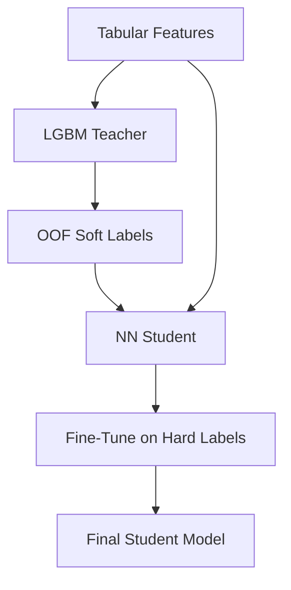

## What It Is
Knowledge distillation transfers the "knowledge" of one model (the teacher) to another (the student) by training the student on the teacher's predicted probabilities (soft labels) rather than only the ground-truth binary labels. Soft labels carry inter-class relationship information that binary targets discard.

In Kaggle, this is particularly powerful for **cross-model-family distillation**: use a well-calibrated LGBM (teacher) to train a Transformer NN (student). The NN then learns from LGBM's structured knowledge of tabular features, allowing it to start from a better initialization than random, before being fine-tuned on hard ground-truth labels.

## The Core Pattern: LGBM → NN



**Why LGBM makes a good teacher**:
- Well-calibrated probabilities on tabular data
- Captures feature interactions efficiently
- Fast to train → generates soft labels cheaply
- Errors are systematic (not random) → student can learn around them

**Why the NN makes a good student**:
- Can process sequential data (RNN/Transformer) that LGBM cannot
- Can learn non-linear transformations more expressive than trees
- Starting from LGBM's knowledge avoids poor local minima from random init

## Generating Soft Labels (OOF to Prevent Leakage)

```python
import lightgbm as lgb
import numpy as np
from sklearn.model_selection import StratifiedKFold

def generate_lgbm_soft_labels(X_train, y_train, X_test, lgbm_params, n_splits=10):
    """
    Generate OOF soft labels for training data and averaged predictions for test.
    OOF prevents target leakage into the student's training signal.
    """
    kf = StratifiedKFold(n_splits=n_splits, shuffle=True, random_state=42)
    oof_soft = np.zeros(len(X_train))
    test_soft = np.zeros(len(X_test))
    
    for fold_idx, (tr_idx, val_idx) in enumerate(kf.split(X_train, y_train)):
        model = lgb.LGBMClassifier(**lgbm_params)
        model.fit(X_train[tr_idx], y_train[tr_idx],
                  eval_set=[(X_train[val_idx], y_train[val_idx])],
                  callbacks=[lgb.early_stopping(50)])
        oof_soft[val_idx] = model.predict_proba(X_train[val_idx])[:, 1]
        test_soft += model.predict_proba(X_test)[:, 1] / n_splits
    
    return oof_soft, test_soft
```

**Critical**: OOF for training soft labels — never fit LGBM on full training data and apply to itself. That leaks targets. The OOF procedure ensures the soft label for sample `i` comes from a model that never saw sample `i` during training.

## 4-Cycle Cosine Schedule

Rather than a single distillation pass followed by fine-tuning, alternate between them with cosine LR annealing. From AmEx 14th (Chris Deotte):

```python
import torch
from torch.optim.lr_scheduler import CosineAnnealingLR

def train_with_distillation_cycles(model, X_train, y_train_hard, y_train_soft,
                                    X_val, y_val, n_cycles=4):
    optimizer = torch.optim.Adam(model.parameters())
    
    cycle_configs = [
        # (target, max_lr, n_epochs)
        ('soft', 1e-3, 20),   # Cycle 1: distillation
        ('hard', 5e-4, 20),   # Cycle 2: fine-tune
        ('soft', 3e-4, 15),   # Cycle 3: re-distill
        ('hard', 1e-4, 15),   # Cycle 4: final fine-tune
    ]
    
    best_val_score = -np.inf
    for target_type, max_lr, n_epochs in cycle_configs:
        # Reset LR to cycle max
        for g in optimizer.param_groups:
            g['lr'] = max_lr
        
        scheduler = CosineAnnealingLR(optimizer, T_max=n_epochs, eta_min=1e-7)
        y_target = y_train_soft if target_type == 'soft' else y_train_hard
        
        for epoch in range(n_epochs):
            train_epoch(model, X_train, y_target, optimizer)
            scheduler.step()
        
        val_score = evaluate(model, X_val, y_val)
        if val_score > best_val_score:
            best_val_score = val_score
            save_checkpoint(model)
    
    return load_checkpoint()
```

**Why cycles beat single-pass**:
- Each soft→hard alternation lets the model re-optimize the LGBM-knowledge vs. ground-truth balance
- Cosine annealing ensures smooth convergence within each cycle (no sudden LR jumps)
- Later cycles can use lower LR for fine-grained refinement

## Temperature Scaling (Optional Enhancement)

Standard distillation adds a "temperature" parameter to soften/sharpen the teacher's output:

```python
def soft_labels_with_temperature(logits, temperature=3.0):
    """Higher temperature → softer probability distribution."""
    return torch.softmax(logits / temperature, dim=-1)
```

- `temperature=1.0` → original probabilities
- `temperature>1.0` → softer (more uniform) — gives student more gradient signal on non-peak classes
- `temperature<1.0` → sharper — emphasizes the teacher's most confident predictions

For LGBM → NN (Kaggle context), temperature scaling is usually unnecessary since LGBM already outputs well-calibrated probabilities. Use it if the teacher is overconfident.

## Nested K-Fold for Leak-Free CV (10-in-10)

Standard 5-fold CV uses the same hold-out set for both model selection and performance estimation — a subtle double-dip that biases estimates upward.

**Nested 10-in-10 K-fold** (Chris Deotte):
```python
from sklearn.model_selection import KFold

outer_kf = KFold(n_splits=10, shuffle=True, random_state=42)
outer_scores = []

for outer_tr, outer_val in outer_kf.split(X):
    # Hyperparameter search uses only outer_tr data
    inner_kf = KFold(n_splits=10, shuffle=True, random_state=42)
    inner_scores_by_hp = {}
    
    for hp_config in hyperparameter_grid:
        inner_cv_scores = []
        for inner_tr, inner_val in inner_kf.split(X[outer_tr]):
            model = train(X[outer_tr[inner_tr]], y[outer_tr[inner_tr]], hp_config)
            score = evaluate(model, X[outer_tr[inner_val]], y[outer_tr[inner_val]])
            inner_cv_scores.append(score)
        inner_scores_by_hp[hp_config] = np.mean(inner_cv_scores)
    
    best_hp = max(inner_scores_by_hp, key=inner_scores_by_hp.get)
    
    # Final evaluation: train on all outer_tr with best_hp, evaluate on outer_val
    # outer_val was NEVER used in inner loop
    final_model = train(X[outer_tr], y[outer_tr], best_hp)
    outer_scores.append(evaluate(final_model, X[outer_val], y[outer_val]))

# outer_scores is an unbiased estimate of generalization performance
print(f"Nested CV: {np.mean(outer_scores):.4f} ± {np.std(outer_scores):.4f}")
```

**Use when**: You want an unbiased estimate of performance AND you're doing hyperparameter selection. Standard CV gives optimistically biased estimates when the same hold-out is used for selection and evaluation.

**Cost**: 10×10 = 100 model fits. Feasible with fast models (LGBM, Ridge) or on GPU (RAPIDS cuDF).

## RAPIDS cuDF: GPU-Accelerated Feature Engineering

```python
import cudf      # GPU DataFrame — same API as pandas
import cupy as cp  # GPU numpy

# Drop-in replacement for pandas operations
df = cudf.read_parquet('large_data.parquet')

# Groupby on GPU (10-100x faster than pandas on large data)
agg = df.groupby('customer_id').agg({
    'balance': ['mean', 'std', 'min', 'max', 'last'],
    'payment': ['mean', 'sum'],
})

# Convert to CPU when needed for sklearn/LightGBM
agg_cpu = agg.to_pandas()
```

**Speedup**: 10–100× over pandas depending on operation type:
- Groupby aggregations: ~50–100×
- Joins: ~30–50×
- Rolling windows: ~20–50×
- Simple column operations: ~10×

**Requirements**: NVIDIA GPU with CUDA + RAPIDS installed. Use little-brother (RTX 2070 Super) or big-brother.

```bash
# Install (requires conda)
conda install -c rapidsai -c conda-forge cudf=23.10 python=3.10 cuda-version=11.8
```

**When to use**: Datasets > 1M rows where pandas groupby takes > 5 minutes. On smaller datasets the overhead of GPU transfer isn't worth it.

## When to Apply Distillation

| Scenario | Recommended Approach |
|----------|---------------------|
| LGBM CV plateaued; want NN uplift | LGBM → NN distillation |
| Sequential data (RNN/Transformer) + tabular features | Distill LGBM tabular knowledge into sequential NN |
| Small dataset; LGBM overfits but NN doesn't | Ensemble, not distillation (both models struggle) |
| Large dataset; NN trains well from scratch | Skip distillation (no benefit) |
| Feature engineering expensive | Generate soft labels once; reuse across NN architectures |

## Sources
- [[../../raw/kaggle/solutions/amex-default-14th-chris-deotte.md]] — LGBM→NN distillation, 4-cycle cosine schedule, nested 10-in-10 K-fold, RAPIDS cuDF

## Related
- [[../concepts/validation-strategy]] — nested CV is the correct choice when distillation introduces selection bias
- [[../concepts/denoising-autoencoders]] — DAE pre-training is complementary to distillation
- [[../concepts/ensembling-strategies]] — distilled NN + LGBM blend is the final step
- [[../concepts/pseudo-labeling]] — soft labels vs. pseudo-labels (different use cases)
