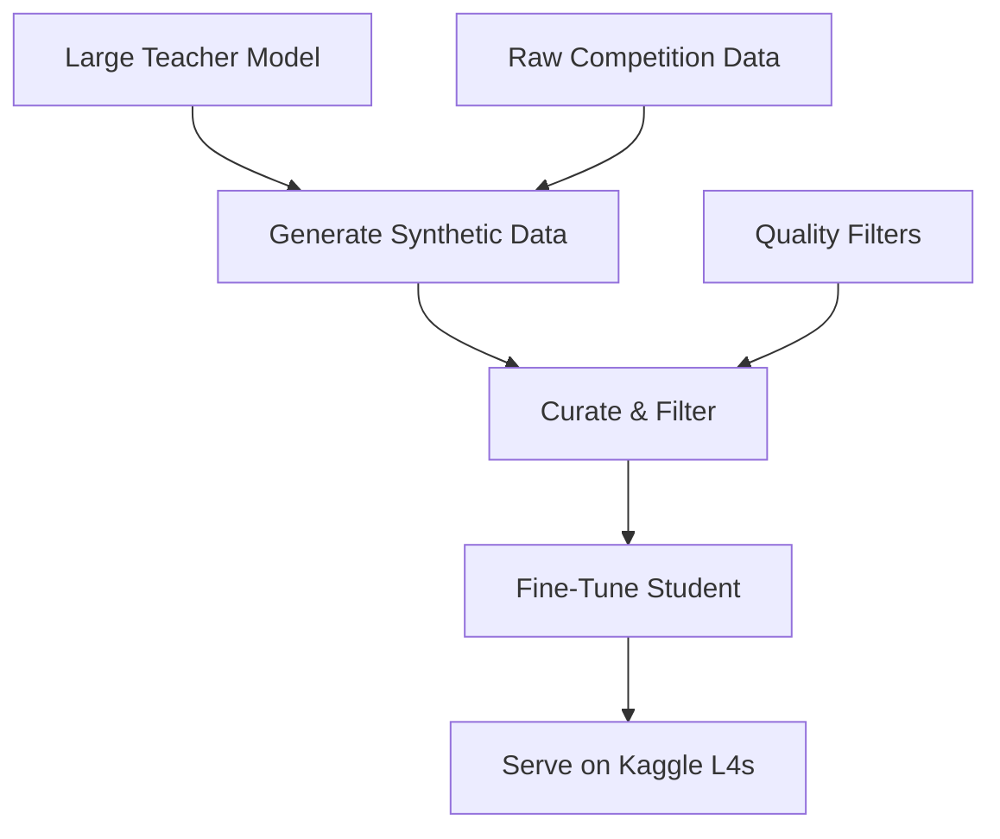

<details><summary>Sources</summary>

- [[../../raw/kaggle/kaggle-meta-2024-2026.md]] — meta-analysis documenting distillation as the dominant 2024-2026 winning pattern
- [[../../raw/kaggle/kaggle-meta-2024-2026-links.md]] — AIMO-2 arXiv paper, OpenMathReasoning dataset, NeMo/Skills repo

</details>

## Summary

80% of gold medals in 2024-2026 Kaggle competitions involving text, images, audio, or molecules came from teams who generated synthetic training data with a large teacher model and distilled into a smaller student that fits Kaggle's 9-hour runtime. This is the single most impactful pattern shift in competitive ML.

## What It Is



A two-phase approach:
1. **Generation phase**: Use a large model (DeepSeek-R1, QwQ-32B, Gemini, GPT-4o) to generate synthetic training examples — chain-of-thought solutions, labeled data, augmented samples
2. **Distillation phase**: Fine-tune a smaller model (Qwen2.5-14B, Gemma2-9B) on the synthetic data using LoRA/QLoRA, sized to fit Kaggle's compute constraints

## When To Use It

- **LLM competitions** (math reasoning, code generation, NLP): almost mandatory for gold
- **Multimodal competitions** (VQA, image+text): teacher generates structured labels
- **Any competition where labeled data is scarce**: teacher can label unlabeled examples
- **NOT typical for pure tabular**: GBDTs don't benefit from synthetic text; use pseudo-labeling instead

## The AIMO-2 Case Study

The definitive example. NVIDIA's NemoSkills team won AIMO-2 (34/50) with:

| Component | Detail |
|-----------|--------|
| **Student** | Qwen2.5-14B-Base → OpenMath-Nemotron-14B-Kaggle |
| **Training data** | 306K problems from OpenMathReasoning dataset |
| **Synthetic solutions** | 2.2M chain-of-thought + 15K tool-integrated-reasoning solutions |
| **Teachers** | DeepSeek-R1, QwQ-32B |
| **Fine-tuning** | SFT on curated subset |
| **Inference** | TIR mode on Kaggle L4s; self-consistency voting; heuristic early stopping |
| **2nd place** | imagination-research: SFT + DPO on Qwen + KV-cache quantization |

**Key insight**: Teacher distillation + code-execution at inference beats raw scaling every time on Kaggle's compute budget.

## Practical Pipeline

### Step 1: Choose Teacher and Student

| Teacher (generation) | Student (competition) | Use Case |
|---------------------|----------------------|----------|
| DeepSeek-R1 (671B) | Qwen2.5-14B | Math reasoning |
| QwQ-32B | Qwen2.5-14B | Math reasoning |
| GPT-4o | Gemma2-9B | Text classification, NLP |
| Gemini | Gemma2-9B | Multimodal |
| Claude | Qwen2.5-32B | Structured extraction |

### Step 2: Generate Synthetic Data

```python
# Pseudocode — generate CoT solutions with teacher
for problem in competition_problems:
    for _ in range(N_SOLUTIONS):  # generate multiple per problem
        response = teacher.generate(
            prompt=f"Solve step by step:\n{problem}",
            temperature=0.7  # diversity
        )
        if verify_answer(response, problem.answer):
            synthetic_data.append({
                "problem": problem,
                "solution": response
            })
```

**Critical**: Filter aggressively. Only keep solutions that produce correct answers. Quality > quantity.

### Step 3: Fine-Tune Student

```bash
# Unsloth on Kaggle 4×L4
python train.py \
    --model qwen2.5-14b-base \
    --method qlora \
    --rank 64 \
    --data synthetic_filtered.jsonl \
    --epochs 3 \
    --lr 2e-4
```

### Step 4: Inference Within Notebook Limits

```bash
# vLLM serving inside 9-hour window
python -m vllm.entrypoints.openai.api_server \
    --model ./finetuned-student \
    --tensor-parallel-size 4 \
    --max-model-len 8192
```

For math: use **tool-integrated reasoning (TIR)** — model writes Python code, executes it, uses results. Add **self-consistency voting** (generate N solutions, majority vote on answer).

## Hyperparameters

| Parameter | Typical Range | Notes |
|-----------|--------------|-------|
| LoRA rank | 32-128 | Higher for more complex tasks |
| Learning rate | 1e-4 to 3e-4 | Standard QLoRA range |
| Epochs | 2-5 | More data → fewer epochs |
| Synthetic solutions per problem | 5-50 | AIMO-2 used ~7 avg |
| Self-consistency samples | 32-128 | More = better but slower |
| Temperature (generation) | 0.5-0.8 | Balance diversity vs quality |

## Gotchas

- **Quality filtering is everything**: Unfiltered synthetic data degrades the student. The AIMO-2 team curated from 306K problems down to a focused subset.
- **Teacher contamination**: If the teacher was trained on the test set (benchmark contamination), distilled knowledge leaks. AIMO and Konwinski Prize explicitly designed evaluations to prevent this.
- **Compute budget mismatch**: Generation is expensive (need access to large teacher). Fine-tuning and inference must fit Kaggle's limits. Plan the compute split carefully.
- **DPO after SFT**: 2nd-place AIMO-2 added DPO (Direct Preference Optimization) after SFT — useful when you have both correct and incorrect solutions to contrast.
- **KV-cache quantization**: For serving large models within memory limits, W4KV8 quantization (4-bit weights, 8-bit KV cache) preserves quality while halving memory.

## In Jason's Work

Not yet applied. Primary candidates:
- Any future LLM competition (AIMO-3 style)
- AUTOPILOT VQA could benefit — use Claude/Gemini as teacher to generate structured labels, distill into smaller VLM for inference
- March Mania: NOT applicable (tabular; use pseudo-labeling and ensembling instead)

## Related

- [[kaggle-landscape-2024-2026]] — meta-analysis showing this as the dominant 2024-2026 pattern
- [[knowledge-distillation]] — narrower technique (LGBM→NN soft labels, not synthetic data generation)
- [[llm-fine-tuning-kaggle]] — LoRA/QLoRA fine-tuning mechanics
- [[pseudo-labeling]] — the tabular equivalent of synthetic data (use model predictions as labels)
- [[../strategies/kaggle-competition-playbook]] — where distillation fits in the overall workflow
