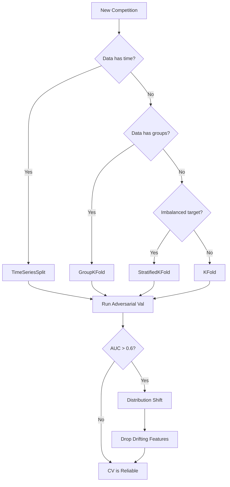

<details><summary>Sources</summary>

- [[../../raw/kaggle/kaggle-competition-playbook.md]] — CV design section
- [[../../raw/kaggle/grandmaster-meta-strategies.md]] — CV-LB gap tracking principles
- [[../../raw/kaggle/timeseries-nlp-techniques.md]] — purged CV and walk-forward patterns

</details>

## What It Is
Validation strategy determines how you estimate model performance on unseen data. A good CV score that reliably predicts LB score is the foundation of every Kaggle campaign. A broken CV (due to leakage, wrong split, or distribution mismatch) causes bad model selection decisions even if individual models are good.



## CV Design Principles

### Match the LB split exactly
The single most important principle. If the LB is a time-based hold-out, your CV must be a time-based split. If the LB is stratified by group, use `GroupKFold`.

| Data type | CV strategy |
|-----------|------------|
| I.I.D. tabular | `StratifiedKFold(n_splits=5)` (classification) or `KFold` (regression) |
| Time-series | `TimeSeriesSplit` — **never shuffle** |
| Group data (users, sessions, subjects) | `GroupKFold` — all rows of a group in same fold |
| Imbalanced classification | `StratifiedKFold` to preserve class ratios |

**Minimum 5 folds**. For small datasets (<2000 rows): 10-fold or leave-one-out.

### Never shuffle time-series data
Shuffling time-series before split creates leakage — future data leaks into training folds. Always sort by time before splitting.

```python
df = df.sort_values('date').reset_index(drop=True)
tss = TimeSeriesSplit(n_splits=5)
for tr_idx, val_idx in tss.split(df):
    # train < validation in time — correct
```

### Adversarial Validation — Run This First
Before any modeling, train a classifier to distinguish train vs. test rows. High AUC (>0.6) means distribution shift — your CV won't predict LB well.

```python
import lightgbm as lgb
import numpy as np

# Label 0 = train, 1 = test
X_adv = pd.concat([X_train, X_test], axis=0)
y_adv = np.array([0]*len(X_train) + [1]*len(X_test))

from sklearn.model_selection import cross_val_score
from sklearn.ensemble import GradientBoostingClassifier
adv_model = lgb.LGBMClassifier(n_estimators=100, random_state=42)
scores = cross_val_score(adv_model, X_adv, y_adv, cv=5, scoring='roc_auc')
print(f"Adversarial AUC: {scores.mean():.4f} ± {scores.std():.4f}")

# If AUC > 0.6: inspect feature importances of adversarial model
# Top features are the drifting ones — drop or transform
adv_model.fit(X_adv, y_adv)
feat_imp = pd.Series(adv_model.feature_importances_, index=X_adv.columns)
print(feat_imp.sort_values(ascending=False).head(10))
```

Features that predict train-vs-test well should be dropped or transformed — they'll hurt LB even if they boost CV.

## Tracking the CV-to-LB Gap

Log every submission in a table:

```markdown
| Model | CV Score | LB Score | Gap | Notes |
|-------|----------|----------|-----|-------|
| LGB baseline | 0.8420 | 0.8391 | +0.0029 | slight overfit |
| LGB + text features | 0.8512 | 0.8480 | +0.0032 | gap widening |
| LGB + XGB ensemble | 0.8550 | 0.8545 | +0.0005 | gap narrowed — good |
```

**Interpreting the gap**:
- **Stable gap**: CV predicts LB reliably — trust CV for model development
- **Growing gap** (CV improving faster than LB): overfitting to CV folds; check for leakage in features; CV may not match LB split
- **Inverted gap** (LB > CV): you found a leak, or LB sample is from a favorable distribution; enjoy it but don't over-optimize for LB

**Rule**: When CV and LB disagree, trust CV for feature/model development. Use LB only for final submission selection — and only when you have enough submissions to distinguish signal from noise (~5+ submissions with clear ordering).

## The CV-LB Breakdown Threshold (2025 Finding)

From S6E2 1st place (Masaya Kawamata): At some point, CV improvements stop translating to LB gains — a "split overfitting" regime. **Identify this threshold and don't optimize past it.**

How to detect it:
1. Track CV vs LB for every submission
2. As CV climbs, LB should climb proportionally
3. When CV keeps improving but LB plateaus or regresses → you've hit the breakdown threshold
4. Set your CV optimization ceiling at the last point where CV and LB moved together

**Practical:** The winner had CV=0.955865 (best) but chose 0.955780. At CV>0.95578, the two decoupled.

**Why this happens:** At some CV level, you've captured all the "real" signal. Further CV improvement is capturing CV-specific noise, not generalizable patterns.

## Post-Cutoff CV

From S5E12 1st place: Use data **after the public LB cutoff date** as your most reliable validation signal.

```python
# Competition has public LB using rows before cutoff_date
# Use rows AFTER cutoff_date (not in public LB) as independent CV
post_cutoff_mask = df['date'] > public_lb_cutoff_date
X_post_cv = df[post_cutoff_mask][features]
y_post_cv = df[post_cutoff_mask][target]
# This data is held out from both training and public LB scoring
# → most reliable signal for final selection
```

## FE-Driven vs HPO-Driven CV Improvements

From Home Credit 2024 1st place: **Feature engineering CV improvements correlate to LB far more reliably than hyperparameter-driven improvements.**

| CV improvement type | LB correlation |
|---|---|
| New feature added | High (when improvement >0.01) |
| Hyperparameter tuning | Low (often noise unless large delta) |

**Implication:** When deciding whether a CV gain is "real," consider the source. FE-based gains are more trustworthy.

## Adversarial Validation — Distribution Shift Correction

Beyond just dropping shift features, you can weight training examples by their "test-likeness":

```python
# After finding adversarial classifier...
train['test_weight'] = adversarial_classifier.predict_proba(X_train)[:, 1]
# Weight rows that look more like test data higher
model.fit(X_train, y_train, sample_weight=train['test_weight'])
```

This shifts your model toward the test distribution without discarding data.

## Final Submission Selection

**Pick 2 submissions** (Kaggle allows this for final cut):
1. **Best CV score** — most reliable; best protection against overfit LB
2. **Best ensemble of diverse models** — insurance if your main model's CV overfit

**What not to do**: Pick based on a single LB submission that happened to score well. High variance — you might be selecting noise.

Diversity filter: Among your top-5 models by CV, pick the pair with lowest OOF prediction correlation. High correlation between your two picks = false safety.

## OOF as the Backbone

Out-of-fold (OOF) predictions are the currency of proper Kaggle development:
- CV score = evaluate metric on concatenated OOF predictions across all folds
- Stacking level-2 = train meta-learner on OOF matrix
- Model diversity = compute correlation on OOF predictions
- Feature selection = compare OOF score with/without each feature

Always generate and save OOF predictions during training.

## Anti-Patterns

| Anti-Pattern | Why It's Bad | Fix |
|-------------|-------------|-----|
| Shuffling time-series before CV split | Future data leaks into past folds | Sort by time, use `TimeSeriesSplit` |
| Using LB score for feature selection | Wastes submission slots; high variance | Use CV for all feature/model decisions |
| Tuning hyperparameters on LB score | Overfits to the specific LB holdout | Tune on CV; use LB as sanity check |
| Ignoring adversarial validation | Misses distribution shift | Run adv val as first EDA step |
| Single CV fold | High variance estimate | Always use ≥5 folds |
| Leaky features in CV | CV looks great, LB is bad | Check any feature that seems too good |
| Target encoding without OOF | Target leaks into features | Always use K-fold OOF target encoding |

## In Jason's Work

### March Mania — CV Design
Historical game predictions. CV is stratified by season (train on seasons Y-N to Y-1, validate on season Y). This matches how Kaggle evaluates: stage 1 uses historical games, stage 2 uses actual 2026 tournament.

**Observed**: v11 and v12 improved CV slightly vs v6 but performed worse on LB. This could mean: (a) slight CV leakage in the new features, or (b) those features don't generalize to tournament play specifically. The growing gap pattern.

### Action Rule
When a feature improves CV but hurts LB: run adversarial validation to check if that feature drifts between train and LB test sets. If it's a drifting feature → drop it.

## Sources
- [[../../raw/kaggle/kaggle-competition-playbook.md]] — §9 validation strategy, §10 anti-patterns
- [[../../raw/kaggle/memory-2026-02-22-update.md]] — v11/v12 CV vs LB discrepancy notes
- [[../../raw/kaggle/2024-2025-winning-solutions-tabular.md]] — CV-LB breakdown threshold (S6E2), post-cutoff CV (S5E12), FE vs HPO insights (Home Credit 2024)
- [[../../raw/kaggle/grandmaster-meta-strategies.md]] — comprehensive meta-strategy including adversarial validation, shake-up survival

## Related
- [[../concepts/target-encoding]] — OOF is required for correct target encoding
- [[../concepts/ensembling-strategies]] — OOF predictions power stacking
- [[../concepts/time-series-cv]] — time series specific CV strategies
- [[../strategies/march-mania-v6-ensemble]] — validation decisions that led to v6 as ceiling
- [[../strategies/kaggle-meta-strategy]] — high-level strategy that validation fits into
