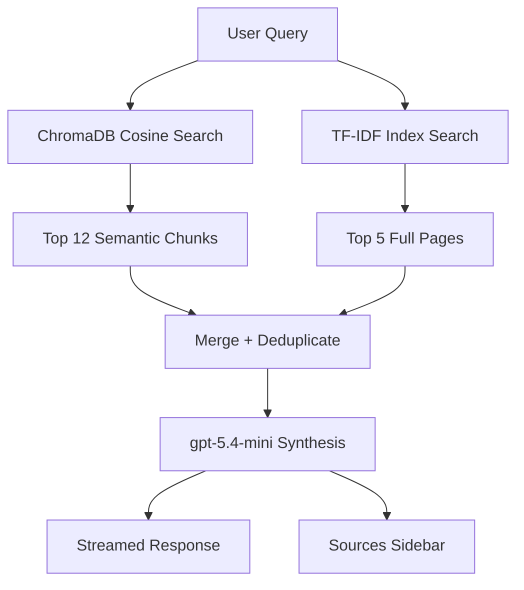

## Summary

MachineLearningAdvisor is a Python Shiny app wrapping the llm-wiki knowledge base in a conversational interface. It uses hybrid retrieval (ChromaDB semantic search + keyword index search) synthesized by gpt-5.4-mini. Primary use case: paste a Kaggle competition description, receive a structured ML strategy document.

## What It Is

A local + deployed web app at `/Users/macbook/Documents/MachineLearningAdvisor`, published to shinyapps.io (karpeles account). Built 2026-04-16 as an extension of Karpathy's LLM wiki pattern, adding a RAG layer to overcome the scalability limits of pure index-based navigation at ~100+ documents.

## Architecture

## Key Parameters

| Setting | Value |
|---------|-------|
| Embedding model | `text-embedding-3-small` |
| Synthesis model | `gpt-5.4-mini` (toggle to `gpt-5.4`) |
| ChromaDB path | `db/chroma/` |
| Collection name | `ml_wiki` |
| Semantic top-k | 12 chunks |
| Index top-k | 5 full pages |
| Chunk size | 500 tokens, 100 overlap |
| Initial corpus | 948 chunks, 102 docs |

## Competition Strategy Mode

When a full competition description is pasted, the system prompt activates a structured output:
- Competition Analysis (task, metric, constraints)
- Recommended Strategy (phase-by-phase plan)
- Data & Feature Engineering (specific techniques from knowledge base)
- Training & Validation (CV strategy, HPO priorities)
- What NOT To Do (pitfalls from similar competitions)
- Jason's Relevant Prior Work

## Tabs

- **Advisor** — streaming chat with source attribution sidebar
- **Ingest** — upload documents → AI auto-updates wiki pages + embeddings
- **Browse** — searchable index table with in-place document viewer

## Sources

- [[../../raw/system/machine-learning-advisor-app]] — full implementation reference

## Related

- [[../overview]] — wiki this system is built on top of
- [[../concepts/ensembling-strategies]] — primary content retrieved for ensemble questions
- [[../strategies/kaggle-meta-strategy]] — primary content retrieved for strategy questions

<!-- kg:begin -->
<!-- This block is auto-generated by tools/inject_kg_blocks.py — do not hand-edit -->
## Knowledge Graph

**Outgoing:**
- _requires_ → [[concepts/ensembling-strategies|Ensembling Strategies — Fourth-Root Blend, Stacking, Diversity]]
- _applied_in_ → [[strategies/kaggle-meta-strategy|Kaggle Meta-Strategy — Grandmaster Principles for Any Competition]]
- _cites_ → `source:machine-learning-advisor-app` (MachineLearningAdvisor — Implementation Reference)
- _works_with_ → [[overview|Knowledge Base Overview]]

**Incoming:**
- [[entities/claude-sonnet|Claude Sonnet]] _works_with_ → here
- [[index|Wiki Index]] _related_to_ → here

<!-- kg:end -->
