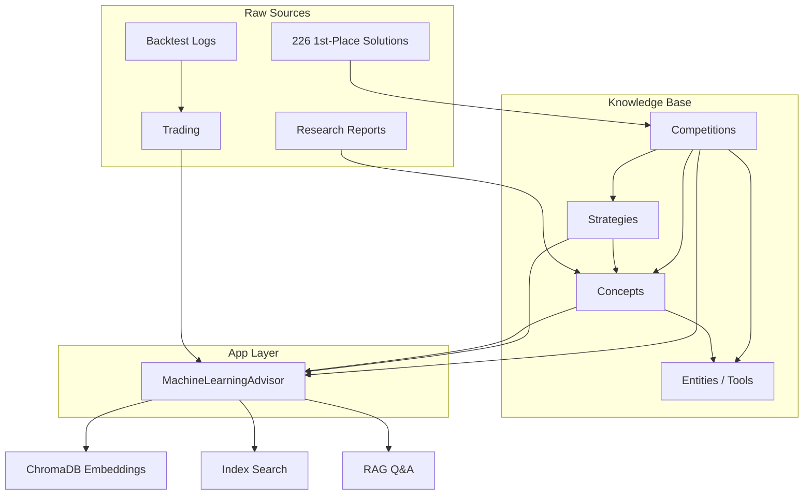

## What This Wiki Is

This is Jason's ML and Kaggle knowledge base, maintained by LLM sessions following the schema in `CLAUDE.md`. It captures:
- Active and historical Kaggle competition strategies
- ML techniques and what worked/didn't
- Live trading strategies and backtest results
- Tool and framework notes
- Cross-cutting analyses and insights

## Domain Map

### Competitions
Jason competes in Kaggle ML competitions, typically solo. Focus areas:
- **Sports prediction**: March Mania (NCAA basketball) — most active
- **Computer vision**: AUTOPILOT VQA (dashcam classification) — active April 2026
- **NLP/Bioinformatics**: Harmonizing (SDRF extraction), PAML Author prediction
- **Misc tabular**: Wine quality, Bidding predictions

Primary metric: getting on the leaderboard top-10, ideally top-3.

### ML Techniques Used
- **Gradient boosting**: XGBoost (primary), LightGBM, CatBoost
- **Linear**: Logistic Regression (calibrated)
- **Ensemble methods**: Weighted averaging, stacking, meta-ensembling
- **VLMs**: Qwen2.5-VL-32B, Claude Sonnet for vision tasks
- **Calibration**: Platt scaling on LogReg components

### Trading
Live forex straddle strategy on OANDA, focused on NFP (Non-Farm Payroll) events. Three pairs: USD_JPY, EUR_USD, GBP_USD. 25 units per trade. Real money — treat with care.

### Infrastructure
- **middle-child**: Agent host (32GB Intel Mac) — no ML training
- **big-brother** (192.168.4.243): Primary ML worker
- **little-brother** (192.168.4.63, RTX 2070 Super): GPU inference

## Current Status (2026-04-14)
| Project | Status | Priority |
|---------|--------|----------|
| March Mania 2026 | Stage 2 submitted; awaiting results | Monitor |
| AUTOPILOT VQA | Active — deadline April 15 | HIGH |
| NFP Straddle | Live and running | Monitor |

## How to Use This Wiki

**Finding information**: Start with `index.md` for the full catalog, or browse by category (`competitions/`, `concepts/`, `strategies/`).

**Adding knowledge**: Follow the INGEST operation in `CLAUDE.md`. Always update `index.md` and `log.md`.

**Cross-referencing**: Follow wikilinks — they connect competition pages to strategy pages to concept pages to entity pages.

## Related
- [[index]] — full content catalog
- [[log]] — chronological audit trail

<!-- kg:begin -->
<!-- This block is auto-generated by tools/inject_kg_blocks.py — do not hand-edit -->
## Knowledge Graph

**Incoming:**
- [[entities/machine-learning-advisor|MachineLearningAdvisor]] _works_with_ → here
- [[index|Wiki Index]] _related_to_ → here

<!-- kg:end -->
