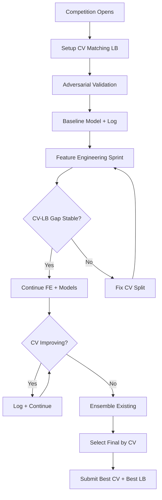

<details><summary>Sources</summary>

- [[../../raw/kaggle/grandmaster-meta-strategies.md]] — KazAnova, Deotte, Goldbloom interviews
- [[../../raw/kaggle/modern-tabular-dl-techniques.md]] — 2024-2025 technique landscape
- [[../../raw/kaggle/solutions/srk-batch-1.md]] through srk-batch-14.md — patterns across 226 1st-place solutions

</details>

## Summary

Cross-competition principles from KazAnova (#2 globally), Chris Deotte (NVIDIA, 4x GM), Anthony Goldbloom (Kaggle CEO), and ML Contests annual analyses. These apply to every tabular competition regardless of domain.



## The Two Winning Approaches (Goldbloom)

Every Kaggle win comes from one of:
1. **Handcrafted feature engineering**: Test hundreds of hypotheses; most fail. The one that works wins.
2. **Deep learning / ensemble NNs**: For unstructured or unusual data. For structured tabular, GBDTs have dominated since Kaggle's founding.

## Top 1% vs Top 10%: The Key Differences

| What Top 10% does | What Top 1% does |
|---|---|
| Simple weighted blending | 2–3 level stacking |
| Focus on models | Spend 20–30% of time on CV setup |
| Single pseudo-label set | K separate pseudo-label sets (one per fold) |
| Ignore train/test distribution shift | Run adversarial validation first |
| Sequential model evaluation | 100+ model variants via GPU parallelism |

## The Core Rule: Trust Your CV

Virtually every Grandmaster cites this as the single most important principle.

**Why:** Public LB typically uses only 20–35% of the test set. A single noisy prediction cluster can swing 50+ ranks. Private LB (65–80%) is far more stable.

### When CV is reliable:
- CV split mirrors the test split exactly (time-split for time-based test, GroupKFold for grouped entities)
- CV-LB correlation is stable across submissions (log both every time)
- CV improvement is consistent across all folds (not just fold 1 or 2)

### When to use LB over CV (rare):
- Very small training data (CV has high variance)
- Known public test leakage you're exploiting deliberately

## CV-LB Relation Tracking

**Log every submission:**
```markdown
| Version | CV Score | LB Score | Gap | Notes |
|---------|----------|----------|-----|-------|
| LGB baseline | 0.8420 | 0.8391 | +0.0029 | stable |
| LGB + FE v1 | 0.8512 | 0.8480 | +0.0032 | gap widening → check |
| Ensemble v1 | 0.8550 | 0.8545 | +0.0005 | gap narrowed — good |
```

**Critical insight from S6E2 1st place:** At some point, CV improvements stop translating to LB gains — a "split overfitting" regime. Identify this **CV-LB breakdown threshold** and don't optimize past it.

**Key finding from Home Credit 2024:** FE-driven CV improvements correlate to LB far more reliably than hyperparameter-driven improvements. Budget your effort accordingly.

## Validating Feature/Model Improvements

- Run ablation over ALL folds, not just fold 1. Compute mean ± std of CV delta.
- If improvement < 1 std dev of fold-to-fold variance → treat as noise.
- Rule of thumb: if improvement only holds in 2/5 folds → likely noise.
- Use permutation importance (shuffle feature, measure score drop on validation set) over default feature importance.

## Seeds and Folds

### Folds:
- 5-fold: standard for most competitions
- 10-fold: small datasets (<2K rows)
- StratifiedKFold: classification with class imbalance
- GroupKFold: entity-level correlation (patient data, time series by entity)
- TimeSeriesSplit: forecasting — NOT using time-aware splits is a fatal mistake

### Seeds:
- Early competition: 1–2 seeds (exploring, not optimizing)
- Last 1–2 days: ensemble across 5–20 seeds — known +0.001–0.003 CV boost
- Seeds matter most for: neural networks, GBMs with small learning rates, anything with randomized subsampling

**Non-negotiable:** Every model in your stack must use exact same fold splits. Fix splits at competition start.

## Final Submission Selection

**Standard (two submissions):**
1. Highest CV model/ensemble — safe, well-calibrated
2. Most diverse runner-up — insurance against subtly wrong CV

**If you've been LB chasing:** Use highest CV model for both slots.

**Practical checklist:**
1. Log CV vs LB for all submissions; compute correlation
2. Identify your top 3 CV models
3. Flag CV-good/LB-suspiciously-high models as overfit suspects
4. Pick top CV + most diverse runner-up (lowest OOF correlation to #1)

## Data Leakage Detection Playbook

**Row-level:**
- `pandas.DataFrame.duplicated()` across train+test on feature subsets
- Check for exact row matches between train and test

**Feature-level:**
- Add `random_noise = np.random.random(len(train))` — if model assigns it high importance, your validation has leakage
- Features with near-zero train variance / high test variance are suspect

**Time-based leakage (most common, most subtle):**
- Any feature computed using "future" data (running means, cumulative stats without shift)
- If CV is suspiciously good on time-series → examine all lag features carefully

**Adversarial Validation (run this first, every competition):**
```python
# Combine train + test, label train=0/test=1
# Train a classifier on this
# AUC > 0.6 = distribution shift
# Top importance features are "shift features" — drop or transform them
# OR weight training rows by test-likelihood score:
train['test_weight'] = adversarial_classifier.predict_proba(X_train)[:, 1]
model.fit(X_train, y_train, sample_weight=train['test_weight'])
```

**Pseudo-label leakage:**
- WRONG: one set of pseudo-labels for all folds
- RIGHT: generate pseudo-labels for fold K using model trained on all OTHER folds

## Optimal 2-Week Time Allocation

| Phase | Days | Activities |
|---|---|---|
| Deep Understanding | 1–3 | Read all high-vote discussions, EDA notebooks. Establish CV framework. Submit baseline. |
| Experimentation | 4–7 | Diverse baselines (LGB/XGB/CAT/NN/linear). Feature engineering. Systematic log. |
| Optimization | 8–11 | HPO (don't over-invest). Feature selection. Model zoo for ensembling. Pseudo-labeling. |
| Hardening | 12–14 | Hill-climbing ensemble. Multi-seed averaging. Final submission selection. Leakage check. |

**Time investment for medal contention:** 15–30 hours/week for month-long competitions.

## Hill-Climbing Ensemble Selection

Greedy weight search on OOF predictions — more robust than weight optimization because it implicitly regularizes.

```python
# pip install hillclimbers
from hillclimbers import climb

best_weights = climb(
    predictions_list,    # list of OOF pred arrays
    y_true,
    metric="roc_auc",    # or "rmse", "logloss"
    maximize=True,
    n_iterations=1000
)
```

Alternative (custom): Start with best model, iteratively add fraction of each other model, keep changes that improve OOF score.

## Shake-Up Survival

1. Every submission must move your CV score. LB-only improvement = treat as noise.
2. Simulate public/private split via CV folds; check ranking stability between simulated public and private sets.
3. Before deadline: Is your best CV model near top of LB? → Safe. Is it not? → Pick CV model for both final slots.
4. **Robust CV > LB chasing.** Top 50 finishers shake up far less than the field — they build on CV.

## What Consistently Doesn't Work (Cross-Competition)

- Transformer models (TabNet, FT-Transformer, TabTransformer) on most financial/insurance tabular data
- K-means clustering as a feature
- Period-based aggregate statistics (income/expense by week/month)
- Nonlinear meta-models / complex stackers as meta-learner
- Pseudo-labeling without proper fold management
- High-order polynomial interaction expansion
- Public leaderboard climbing / over-submission

## Sources
- [[../../raw/kaggle/grandmaster-meta-strategies.md]] — full compiled strategies
- [[../../raw/kaggle/2024-2025-winning-solutions-tabular.md]] — cross-competition pattern validation

## Related
- [[../concepts/validation-strategy]] — CV design and gap tracking details
- [[../concepts/ensembling-strategies]] — hill climbing, stacking, diversity
- [[../strategies/kaggle-competition-playbook]] — tactical execution checklist

<!-- kg:begin -->
<!-- This block is auto-generated by tools/inject_kg_blocks.py — do not hand-edit -->
## Knowledge Graph

**Outgoing:**
- _requires_ → [[concepts/combinatorial-optimization|Combinatorial Optimization in Kaggle Competitions]]
- _requires_ → [[concepts/ensembling-strategies|Ensembling Strategies — Fourth-Root Blend, Stacking, Diversity]]
- _requires_ → [[concepts/external-data-leakage|External Data Usage & Leakage Detection]]
- _requires_ → [[concepts/kaggle-landscape-2024-2026|Kaggle Competitive Landscape 2024-2026]]
- _requires_ → [[concepts/reinforcement-learning-games|Reinforcement Learning for Game AI Competitions]]
- _requires_ → [[concepts/universal-kaggle-tricks|Universal Kaggle Tricks — Cross-Competition Validated Techniques]]
- _requires_ → [[concepts/validation-strategy|Validation Strategy — CV Design, Gap Tracking, Anti-Patterns]]
- _applied_in_ → [[competitions/playground-s5-s6|Kaggle Playground Series S5 & S6 Winning Patterns (2025-2026)]]
- _cites_ → `source:2024-2025-winning-solutions-tabular` (2024–2025 Winning Solutions: Tabular/Financial/Insurance Competitions)
- _cites_ → `source:grandmaster-meta-strategies` (Kaggle Grandmaster Meta-Strategies)
- _cites_ → `source:kaggle-competition-playbook` (Kaggle Competition Playbook)

**Incoming:**
- [[tools/autoresearch|AutoResearch — Autonomous Agent Experimentation for ML Contests]] _applied_in_ → here
- [[entities/machine-learning-advisor|MachineLearningAdvisor]] _applied_in_ → here
- [[index|Wiki Index]] _related_to_ → here

<!-- kg:end -->
