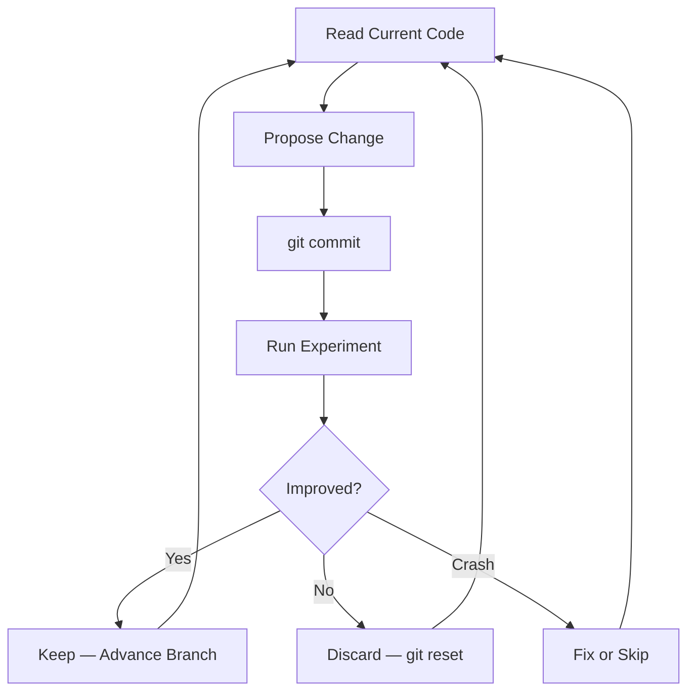

<details><summary>Sources</summary>

- [[../../raw/kaggle/autoresearch-karpathy.md]] — full documentation from github.com/karpathy/autoresearch (74K stars)

</details>

## Summary

[AutoResearch](https://github.com/karpathy/autoresearch) is Karpathy's framework for autonomous AI agent experimentation: an agent modifies training code, runs a fixed-budget experiment, evaluates improvement, keeps or discards, and repeats indefinitely. ~12 experiments/hour, ~100 overnight. Originally built for LLM training (nanochat), the pattern maps directly onto Kaggle competition workflows — hyperparameter search, feature engineering, architecture exploration — with the agent as a tireless overnight researcher.

## How It Works



**Three files:**
- `prepare.py` — immutable: data loading, evaluation, constants. Agent cannot touch.
- `train.py` — the single file the agent edits. Everything fair game.
- `program.md` — human-written instructions directing agent behavior. The "org code."

**Fixed 5-minute time budget** per experiment makes all results directly comparable regardless of what the agent changes (model size, batch size, architecture). Single metric (val_bpb) — lower is better.

**The agent never stops.** It runs indefinitely until manually interrupted. No asking "should I continue?" — the human might be asleep.

## Adaptation for Kaggle Competitions

The autoresearch pattern is a natural fit for Kaggle. The key adaptation: replace val_bpb with the competition metric, replace train.py with a Kaggle training script, and tailor program.md to competition-specific constraints.

### Mapping to Kaggle

| AutoResearch Component | Kaggle Equivalent |
|----------------------|-------------------|
| `train.py` (agent edits) | `train.py` with model + feature pipeline + CV |
| `prepare.py` (immutable) | Data loading, CV splits, evaluation metric |
| `program.md` (human-written) | Competition context, what to try, constraints |
| val_bpb metric | Competition metric (log-loss, RMSE, AUC, etc.) |
| 5-min time budget | Adjustable per competition (5-30 min) |
| results.tsv | Experiment log with CV scores |
| git branch per run | git branch per experiment series |

### Proposed Kaggle `program.md` Template

```markdown
# Kaggle AutoResearch — [Competition Name]

## Context
- Competition: [name, metric, deadline]
- Current best CV: [score]
- Hardware: [GPU available]

## Rules
- Only modify `train.py`
- `prepare.py` contains: data loading, CV splits, metric function
- Time budget: [X] minutes per experiment
- Metric: [metric name] — [lower/higher] is better

## What to try (priority order)
1. Hyperparameter tuning (learning rate, depth, regularization)
2. Feature engineering (interactions, aggregations, encodings)
3. Model architecture changes (add/remove layers, change model type)
4. Ensemble weight optimization
5. Post-processing (clipping, calibration, rank blending)

## What NOT to try
- Don't change the CV split (consistency matters)
- Don't add external data without human approval
- Don't submit to Kaggle (human approval gate)

## Simplicity criterion
Small improvement + ugly complexity = not worth it.
Improvement from removing features/code = always keep.
```

### Kaggle `results.tsv` Extension

```
commit	cv_score	lb_score	memory_gb	status	description
a1b2c3d	0.02210	-	12.3	keep	baseline v6 ensemble
b2c3d4e	0.02195	-	12.5	keep	increase XGB depth to 8
c3d4e5f	0.02230	-	12.3	discard	remove Elo features
d4e5f6g	0.02180	-	14.1	keep	add rolling 10-game stats
```

Add `lb_score` column (filled in manually after submission) to track CV-to-LB gap.

### Where This Excels for Kaggle

**Hyperparameter search**: Agent tries hundreds of param combinations overnight. Better than random search because the agent reads results and adapts — it's a thinking search, not a grid.

**Feature engineering exploration**: Agent adds/removes features, observes CV impact, keeps winners. Particularly powerful for tabular competitions where the feature space is large.

**Architecture iteration**: For DL competitions — agent tries different backbones, layer configs, loss functions, all within fixed time budget.

**Ensemble weight optimization**: With a fixed set of OOF predictions, agent optimizes blend weights against CV metric.

### Where It Needs Adaptation

**Time budget**: 5 minutes works for small models. Kaggle tabular (XGBoost 10-fold) may need 10-30 minutes. DL training may need longer. Adjust `FIXED_TIME_BUDGET` accordingly.

**Metric direction**: val_bpb is lower-is-better. Competition metrics vary — ensure the agent knows which direction to optimize.

**Submission gate**: AutoResearch auto-keeps improvements. For Kaggle, the agent should never submit without human approval. Add explicit guard in program.md.

**Multi-file pipelines**: Karpathy constrains to one file. Kaggle pipelines often span multiple files (feature engineering, model training, ensembling). Consider structuring as a single `pipeline.py` or relaxing the constraint in program.md.

**CV discipline**: The prepare.py / train.py split naturally enforces good CV discipline — the agent can't modify the evaluation code, preventing accidental leakage.

## Implementation on Jason's Infrastructure

| Machine | Role | Suitability |
|---------|------|-------------|
| **big-brother** (192.168.4.243) | Primary ML worker | Best target — run overnight experiments here |
| **little-brother** (RTX 2070 Super) | GPU inference | Possible for smaller experiments; limited VRAM |
| **middle-child** (32GB Intel Mac) | Agent host | Hosts the agent (Claude Code), SSHs to big-brother for training |

**Workflow**: Claude Code on middle-child writes program.md + modifies train.py → SSH to big-brother for each 5-min run → reads results → iterates.

For MacOS-only experiments (no SSH), use the [MLX fork](https://github.com/trevin-creator/autoresearch-mlx).

## Key Design Principles Worth Adopting

1. **Fixed time budget** — makes experiments comparable; prevents runaway training
2. **Single metric** — no ambiguity about what "better" means
3. **Immutable evaluation** — agent can't modify the metric function (prevents cheating/leakage)
4. **Git-based experiment tracking** — every experiment is a commit; easy to diff, revert, review
5. **results.tsv as experiment log** — lightweight, grep-able, no MLflow overhead
6. **Simplicity criterion** — bias toward removing code; only keep complexity if improvement justifies it
7. **Never stop** — the agent is autonomous; human reviews results in the morning

## Karpathy's Insight

> "You're not touching any of the Python files like you normally would as a researcher. Instead, you are programming the program.md Markdown files that provide context to the AI agents and set up your autonomous research org."

The meta-lesson: **the human's job shifts from writing training code to writing instructions that make the agent an effective researcher.** For Kaggle, this means spending time crafting a good program.md (competition context, what to try, what to avoid, metric direction) rather than manually running experiments.

## Related

- [[../concepts/kaggle-landscape-2024-2026]] — current Kaggle winning patterns the agent should know
- [[../strategies/kaggle-competition-playbook]] — end-to-end workflow to encode in program.md
- [[../strategies/kaggle-meta-strategy]] — grandmaster principles for the agent to follow
- [[../concepts/validation-strategy]] — CV design that becomes the immutable prepare.py
- [[../concepts/gradient-boosting-advanced]] — hyperparameters the agent would tune
- [[../concepts/ensembling-strategies]] — ensemble weights the agent could optimize
- [[../concepts/post-processing]] — post-processing tricks to include in the search space

<!-- kg:begin -->
<!-- This block is auto-generated by tools/inject_kg_blocks.py — do not hand-edit -->
## Knowledge Graph

**Outgoing:**
- _requires_ → [[concepts/ensembling-strategies|Ensembling Strategies — Fourth-Root Blend, Stacking, Diversity]]
- _requires_ → [[concepts/gradient-boosting-advanced|Gradient Boosting — Advanced Configuration Tricks]]
- _requires_ → [[concepts/kaggle-landscape-2024-2026|Kaggle Competitive Landscape 2024-2026]]
- _requires_ → [[concepts/post-processing|Post-Processing — RankGauss, Calibration, Clipping, Rank Blending]]
- _requires_ → [[concepts/validation-strategy|Validation Strategy — CV Design, Gap Tracking, Anti-Patterns]]
- _applied_in_ → [[strategies/kaggle-meta-strategy|Kaggle Meta-Strategy — Grandmaster Principles for Any Competition]]
- _cites_ → `source:kaggle-competition-playbook` (Kaggle Competition Playbook)

**Incoming:**
- [[index|Wiki Index]] _related_to_ → here

<!-- kg:end -->
